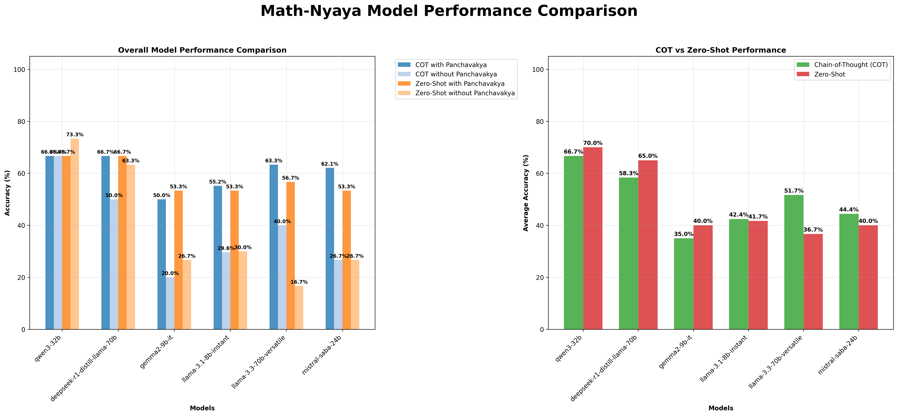

# Math-Nyaya

This project evaluates whether providing a structured logical argument, based on the ancient Indian school of logic called **Nyāya (Panchavakya)**, improves the performance of Large Language Models (LLMs) on multiple-choice questions.

## Project Structure

```
/home/pranav/projects/Math-Nyaya/
├── .env                    # Contains your GROQ API key
├── .gitignore             # Git ignore file
├── requirements.txt       # Python dependencies
├── main.py                # Main script to run the full pipeline
├── test_main.py           # Test script for a limited number of samples
├── data/
│   ├── raw/               # Place your raw CSV data here
│   │   └── initial_questions.csv  # Required input file
│   └── processed/         # Generated output files
│       ├── questions_with_panchavakya.csv
│       └── final_results/ # Results from model evaluations
└── src/                   # Source code
    ├── __init__.py
    ├── config.py          # Configuration settings
    ├── panchavakya_generator.py  # Generates Panchavakya arguments
    ├── evaluator.py       # Evaluates models with/without Panchavakya
    ├── analysis.py        # Analyzes and visualizes results
    └── setup.py           # Sets up the directory structure
```

## How to Use

1. **Setup Environment**:
   ```bash
   python -m venv venv
   source venv/bin/activate  # On Windows: venv\Scripts\activate
   pip install -r requirements.txt
   ```

2. **Add API Key**:
   Create a `.env` file in the root directory with your GROQ API key:
   ```
   GROQ_API_KEY=your-api-key-here
   ```

3. **Prepare Data**:
   Place your dataset in the `data/raw` directory with the filename `initial_questions.csv`. The dataset should have these columns:
   - `question`: The question text
   - `multiple_choice`: A list of options
   - `correct_letter`: The correct answer letter (A, B, C, D, etc.)

4. **Run the Pipeline**:
   - For testing with a limited number of questions:
     ```bash
     python test_main.py
     ```
   - For the full dataset:
     ```bash
     python main.py
     ```

5. **View Results**:
   Results will be saved in `data/processed/final_results/` with CSV files and visualizations for each model and prompt style.

6. **Generate Comparison Charts**:
   To create comprehensive comparison charts across all models:
   ```bash
   python compare_all_models.py
   ```
   This will generate a comprehensive comparison chart saved as `model_comparision.png`.

## Results



The comprehensive comparison chart shows the performance of all evaluated models using both Chain-of-Thought (COT) and Zero-Shot prompting, with and without Panchavakya logical reasoning framework.

## Models

The following models are being tested:
- qwen/qwen3-32b
- deepseek-r1-distill-llama-70b
- gemma2-9b-it
- llama-3.1-8b-instant
- llama-3.3-70b-versatile
- mistral-saba-24b
