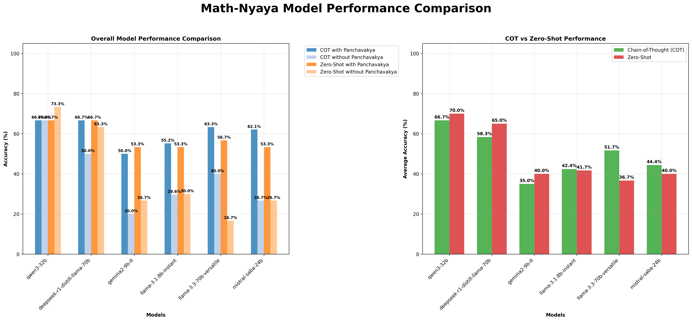
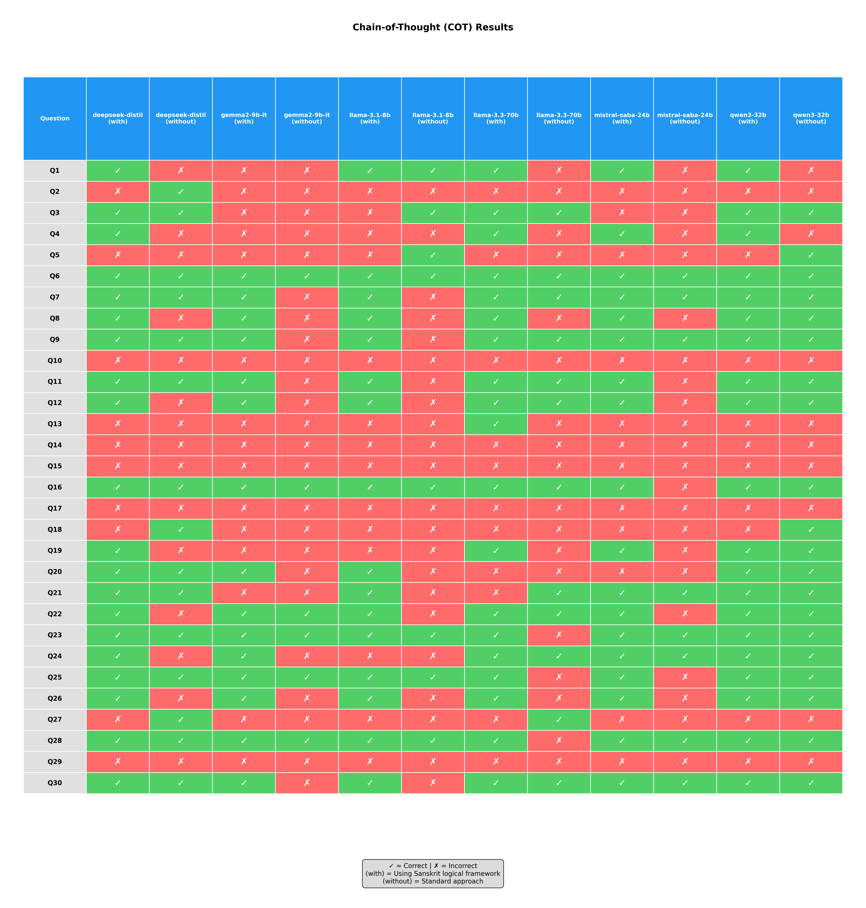
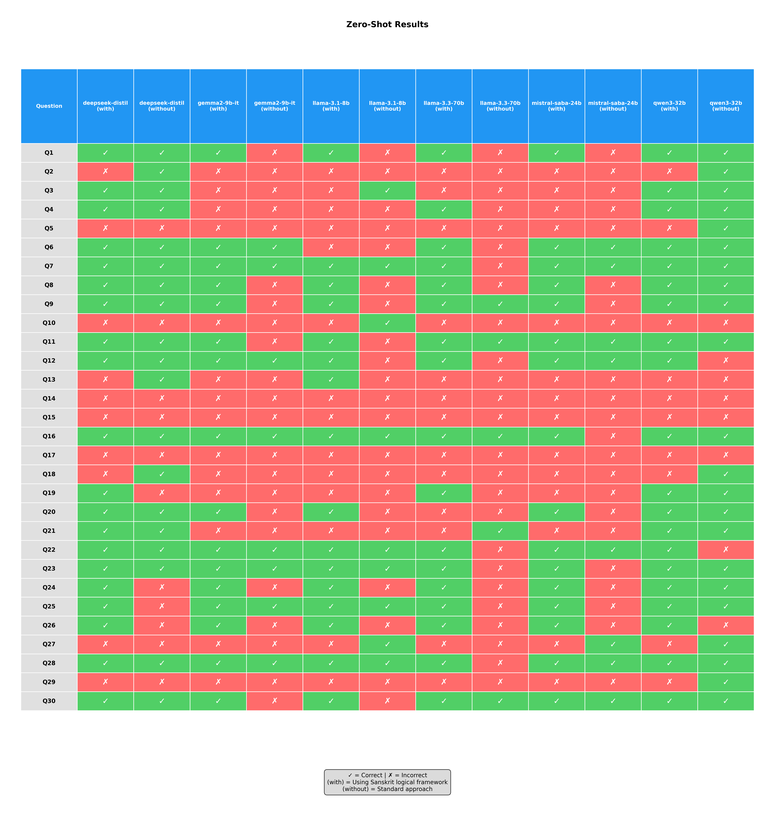

# Math-Nyaya

This project evaluates whether providing a structured logical argument, based on the ancient Indian school of logic called **Nyāya (Panchavakya)**, improves the performance of Large Language Models (LLMs) on both multiple-choice questions (MCQs) and numerical math problems.

## Project Structure

```
/home/pranav/projects/Math-Nyaya/
├── .env                    # Contains your GROQ API key
├── .gitignore             # Git ignore file
├── requirements.txt       # Python dependencies
├── main.py                # Main script to run the full pipeline
├── test_main.py           # Test script for MCQ questions
├── test_numerical.py      # Test script for numerical questions
├── data/
│   ├── raw/               # Place your raw CSV data here
│   │   ├── initial_questions.csv      # MCQ questions
│   │   └── GSM8K wrong Questions - Sample Questions.csv  # Numerical questions
│   └── processed/         # Generated output files
│       ├── questions_with_panchavakya.csv               # MCQ with Panchavakya
│       ├── numerical_questions_with_panchavakya.csv     # Numerical with Panchavakya
│       └── final_results/ # Results from model evaluations
│           ├── mcq/       # MCQ evaluation results
│           └── numerical/ # Numerical evaluation results
└── src/                   # Source code
    ├── __init__.py
    ├── config.py          # Configuration settings
    ├── panchavakya_generator.py      # Generates Panchavakya for MCQs
    ├── numerical_panchavakya_generator.py  # Generates Panchavakya for numerical questions
    ├── evaluator.py       # Evaluates models on MCQs
    ├── numerical_evaluator.py  # Evaluates models on numerical questions
    ├── analysis.py        # Analyzes and visualizes MCQ results
    ├── comprehensive_analysis.py  # Creates comprehensive analysis across both types
    └── setup.py           # Sets up the directory structure
```

## Evaluation Modes

The system supports three evaluation modes (configurable in `main.py`):

1. **"both"** (default): Runs both MCQ and numerical evaluations
2. **"mcq"**: Runs only multiple-choice question evaluations
3. **"numerical"**: Runs only numerical question evaluations

To change the mode, edit the `EVALUATION_MODE` variable in `main.py`:
```python
EVALUATION_MODE = "mcq"  # or "numerical" or "both"
```

## How to Use

1. **Setup Environment**:
   ```bash
   python -m venv venv
   source venv/bin/activate  # On Windows: venv\Scripts\activate
   pip install -r requirements.txt
   ```

2. **Add API Key**:
   Create a `.env` file in the root directory with your GROQ API key:
   ```
   GROQ_API_KEY=your-api-key-here
   ```

3. **Prepare Data**:
   Place your datasets in the `data/raw` directory:
   
   **For MCQ questions** (`initial_questions.csv`):
   - `question`: The question text
   - `multiple_choice`: A list of options
   - `correct_letter`: The correct answer letter (A, B, C, D, etc.)
   
   **For numerical questions** (`GSM8K wrong Questions - Sample Questions.csv`):
   - `question`: The math problem text
   - `Solution`: Step-by-step solution
   - `Answer`: The numerical answer

4. **Run the Pipeline**:
   - For testing MCQ questions with a limited number of samples:
     ```bash
     python test_main.py
     ```
   - For testing numerical questions with a limited number of samples:
     ```bash
     python test_numerical.py
     ```
   - For the full dataset (configure EVALUATION_MODE in main.py):
     ```bash
     python main.py
     ```

5. **View Results**:
   Results will be saved in:
   - `data/processed/final_results/mcq/` for MCQ evaluation results
   - `data/processed/final_results/numerical/` for numerical evaluation results
   
   Each directory contains CSV files and visualizations for each model and prompt style.

6. **Generate Comparison Charts**:
   To create comprehensive comparison charts across all models:
   ```bash
   python compare_all_models.py
   ```
   This will generate:
   - A comprehensive comparison chart saved as `data/processed/final_results/model_comparision.png`
   - Detailed question-by-question results tables for COT and Zero-Shot strategies
   - CSV files with detailed performance data

## Results



The comprehensive comparison chart shows the performance of all evaluated models using both Chain-of-Thought (COT) and Zero-Shot prompting, with and without Panchavakya logical reasoning framework.

### Question-by-Question Results Tables





## Models

The following models are being tested:
- qwen/qwen3-32b
- deepseek-r1-distill-llama-70b
- gemma2-9b-it
- llama-3.1-8b-instant
- llama-3.3-70b-versatile
- mistral-saba-24b
